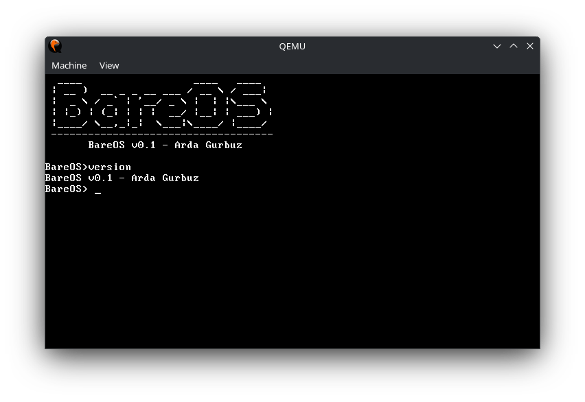

# BareOS

**BareOS** is a minimalist, 32-bit x86 operating system kernel developed from scratch using C and Assembly. This project focuses on understanding low-level hardware communication, interrupt handling, and memory management.

## 🚀 Key Features

* **GDT (Global Descriptor Table):** Configured for flat memory model and protected mode transition.
* **IDT & ISR Handling:** Robust Interrupt Descriptor Table to catch CPU exceptions and manage system events.
* **PIC Remapping:** Hardware interrupts (IRQs) are remapped to avoid conflicts with CPU exceptions, ensuring system stability.
* **Interrupt-Driven Keyboard Driver:** High-performance input handling using IRQ1 instead of inefficient polling.
* **VGA Text Mode Driver:** Custom video driver with support for hardware cursor manipulation and backspace functionality.
* **Integrated Shell:** A basic command-line interface featuring custom-built string utilities (`strcmp`, `strlen`).

## 📸 Preview




## 🛠️ Build & Run

To build and run BareOS, you need `gcc`, `nasm`, `ld`, and `qemu` installed on your system.

1.  **Clone the repository:**
    ```bash
    git clone https://github.com/ardagurbuz24/bareOS.git
    cd bareOS
    ```
2.  **Compile and launch in QEMU:**
    ```bash
    make
    make run
    ```

## 📂 Project Structure

* `/boot`: Bootloader and kernel entry point (Assembly).
* `/kernel/arch/i386`: Architecture-specific code (GDT, IDT, ISR, PIC).
* `/kernel/drivers`: Hardware drivers for VGA and Keyboard.
* `/kernel/include`: Header files for kernel components.
* `/scripts`: Linker scripts for memory layout.

## 🛤️ Roadmap & Future Goals

- [ ] Memory Paging Support
- [ ] Multitasking & Scheduler
- [ ] Simple File System (FAT)
- [ ] User Mode (Ring 3) Implementation

---
Developed by **Arda Gurbuz** (2026).
